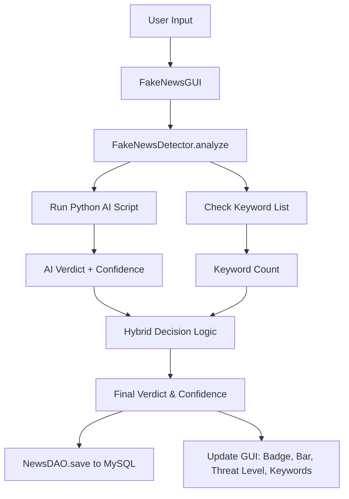

# 🛡️ FactShield – Content Credibility Analyzer

A Java desktop application that detects **AI-generated / fake news** using a hybrid approach: a **Hugging Face transformer model** combined with **keyword analysis**. Built with **Java Swing**, **JDBC/MySQL**, and **Python AI integration**.

---

## 📸 Demo

 *(add a screenshot if possible)*

---

## 🔍 How It Works (Hybrid Detection)

1. **User enters news text** in the GUI.
2. The text is sent to the `FakeNewsDetector` backend.
3. The detector calls a **Python script** running a `roberta-base-openai-detector` model, which returns a verdict (`Real`/`Fake`) and confidence score.
4. Simultaneously, the text is scanned for **fake-news keywords** (e.g., "shocking", "you won't believe", "secret").
5. **Hybrid logic** adjusts the final result:
   - If AI says **Real** but ≥3 keywords are found → **Fake** (85% confidence).
   - If AI says **Fake** and ≥3 keywords → confidence boosted ×1.5 (max 100%).
6. The final verdict, confidence, threat level, and matched keywords are shown in the GUI.
7. The result is saved to a **MySQL database** for history.

---

## 🧠 Architecture Flowchart (Mermaid)



---

## ✨ Features

- 🤖 **AI-powered detection** using Hugging Face `roberta-base-openai-detector`
- 🧠 **Hybrid engine** – combines AI confidence with keyword heuristics
- 🎨 **Rich GUI** – coloured verdict badge, confidence progress bar, threat level indicator
- 📋 **History panel** – view past analyses stored in MySQL
- 🗃️ **Auto-seeding sample data** – ready for demo right after setup
- ⌨️ **Keyboard shortcuts:** `Ctrl+Enter` analyze, `Ctrl+V` paste, `Esc` clear
- 🌗 **Dark mode** toggle with FlatLaf look-and-feel
- 🚀 **Non-blocking analysis** via SwingWorker (GUI stays responsive)
- 📝 **Character counter** (max 500 characters)

---

## 🛠️ Tech Stack

| Layer          | Technology                         |
|----------------|------------------------------------|
| **Frontend**   | Java Swing (FlatLaf theme)        |
| **Backend**    | Java (OOP, ProcessBuilder)        |
| **AI Model**   | Python 3 + Hugging Face Transformers |
| **Database**   | MySQL (via JDBC)                  |
| **Build/Run**  | Shell scripts (`build.sh`, `run.sh`) |

---

## 📁 Project Structure

```
FactShield/
├── ai_detector.py                # Python AI classification script
├── build.sh / build.bat          # Compile Java sources
├── run.sh / run.bat              # Build + launch application
├── README.md
├── .gitignore
├── lib/
│   ├── flatlaf-3.7.jar
│   └── mysql-connector-j-9.7.0.jar
└── src/
    ├── detector/
    │   ├── FakeNewsDetector.java    # Core detection & hybrid logic
    │   └── FakeNewsGUI.java         # Main GUI (Swing)
    └── dao/
        └── NewsDAO.java             # MySQL connection, seeding, history
```

---

## 🧑‍🤝‍🧑 Team & Roles

| Member        | Responsibility                              |
|---------------|---------------------------------------------|
| Harsh         | GUI design (Swing, FlatLaf, event handling) |
| Saksham       | Backend logic (Java OOP, detection orchestrator) |
| Augustiya     | Database integration (JDBC, MySQL)          |
| Anshul        | AI integration (Python script, model selection) |

---

## 🚀 Setup & Run (Quick Start)

### 1. Prerequisites
- **Java JDK** 11+  
- **Python 3** (tested with `/usr/bin/python3`)  
- **MySQL** 8+ (optional – app works without it)  

### 2. Clone the repository
```bash
git clone https://github.com/Harsh7930/FactShield.git
cd FactShield
```

### 3. Install Python dependencies
```bash
python3 -m pip install transformers torch
```
> The first analysis will download the model (~500 MB) – allow a few minutes.

### 4. (Optional) Setup MySQL
Start MySQL and create a database (the app will auto-create tables):
```sql
CREATE DATABASE fake_news_db;
```
Ensure the user `root` has an empty password (or edit `src/dao/NewsDAO.java`).

### 5. Build & Run
**macOS / Linux:**
```bash
chmod +x build.sh run.sh
./run.sh
```
**Windows:**
```bat
build.bat
run.bat
```

The GUI will open. Type a news headline and click **Analyze** (or `Ctrl+Enter`).

---

## 🧪 Test Examples

| Input | Expected Output |
|-------|-----------------|
| *"The city council approved a new budget."* | ✅ CREDIBLE NEWS (green, low threat) |
| *"Shocking! You won't believe what this politician did – 100% true!"* | ⚠️ FAKE NEWS DETECTED (red, high threat, keywords listed) |

---

## 🖥️ GUI Screens (description)
- **Verdict Badge:** Large coloured label (green/red/gray)
- **Confidence Bar:** Progress bar coloured by confidence (green ≥70%, yellow 30–69%, red <30%)
- **Threat Level:** Low / Moderate / High
- **Red-flag Keywords:** Shown if fake and keywords found

---

## 🔧 Troubleshooting

| Problem | Solution |
|---------|----------|
| `ModuleNotFoundError: transformers` | Run `python3 -m pip install transformers torch` |
| `Access denied for user 'root'` | Check MySQL is running and password is empty or update `NewsDAO.java` |
| `ClassNotFoundException` | Run `./build.sh` first |
| GUI shows "Analysis unavailable" | Verify Python is working: `/usr/bin/python3 ai_detector.py "test"` |
| History empty after first run | Table may already have old data; truncate or drop/recreate |

---

## 📜 License
This project is part of an academic assignment. Feel free to use and modify for learning purposes.

---

**Built with ❤️ for Object‑Oriented Programming (Java) – Semester 4**
